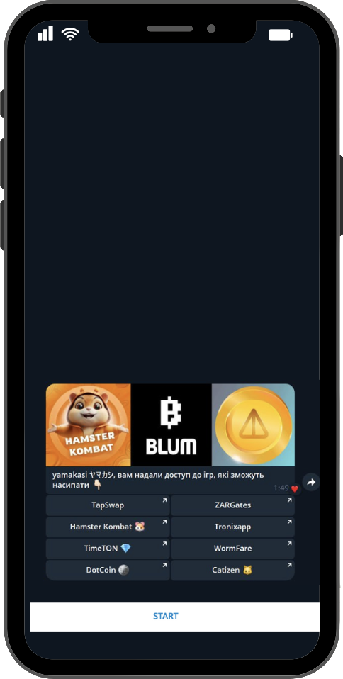

<div style="text-align: center;">
  <h1>TapCoins | Telegram Bot</h1>
  
</div>

## How to Use ?
- install dependencies
    ```bash
    pip install -r requirements.txt
    ```  
- configure environment variables in `.env` file
- make migrations
    ```bash
    alembic upgrade head
    ```
- run bot
    ```bash
    python __main__.py
    ```